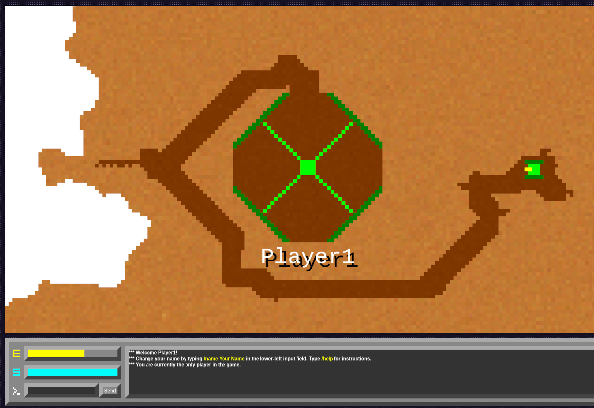

# Tunneler

This project is a remake of Geoffrey Silverton's classic [Tunneler](https://tunneler.org) game for DOS. The game is developed as a HTML5 Canvas and Javascript app, with a small node.js server that facilitates communication between the players. The graphics are a bit different from the original, and some gameplay elements are changed (for example, the map is not randomly generated) but the basic gameplay is the same.

You can play the game on Glitch.com: [https://tunneler.glitch.me](https://tunneler.glitch.me)



## Quick Start

### Option 1: Docker (Recommended)
The easiest way to run Tunneler locally:

```bash
# Clone the repository
git clone <your-repo-url>
cd tunneler

# Start with Docker Compose
docker-compose up --build

# Access the game at http://localhost:3000
```

### Option 2: Local Node.js
If you prefer running directly with Node.js:

```bash
# Install dependencies
npm install

# Start the server
npm start

# Access the game at http://localhost:3000
```

## Development Setup

### Prerequisites
- **Docker & Docker Compose** (recommended), or
- **Node.js 14+** and **npm**

### Docker Development
```bash
# Start in development mode with live reload
docker-compose up --build

# View logs
docker-compose logs -f

# Stop the container
docker-compose down

# Rebuild after code changes
docker-compose up --build
```

### Local Development
```bash
# Install dependencies
npm install

# Start the development server
npm start

# The server will restart automatically on file changes
```

### Making Changes
1. Edit your code files
2. If using Docker: `docker-compose up --build`
3. If running locally: Server restarts automatically
4. Refresh your browser to see changes

## Deployment

### Docker Production Deployment
```bash
# Build for production
docker-compose up -d --build

# Check status
docker-compose ps

# View logs
docker-compose logs tunneler
```

### Manual Deployment
```bash
# Install production dependencies
npm ci --production

# Start the server
NODE_ENV=production node index.js
```

## Game Features

- **Multiplayer**: Real-time WebSocket-based multiplayer
- **Split-screen**: Each player sees their own view
- **Destructible terrain**: Dig tunnels through the map
- **Base management**: Refuel energy and repair at your base
- **Classic gameplay**: Faithful to the original DOS experience

## Credits & Acknowledgments

This project builds upon and is inspired by the work of several contributors to the Tunneler legacy:

### Original Game
- **Tunneler (1991)** by **Geoffrey Silverton** - The original DOS masterpiece
- Official website: [https://tunneler.org](https://tunneler.org)
- Revolutionary for its time with CGA 160×100 graphics and split-screen multiplayer

### Inspiration & Reference Projects
- **[jwharm/tunneler](https://github.com/jwharm/tunneler)** - JavaScript/HTML5 remake that provided foundational insights for web-based implementation
- **[guyromm/tunneler](https://github.com/guyromm/tunneler/tree/master/src)** - C implementation fork that helped preserve understanding of the original game mechanics

**Special thanks** to Geoffrey Silverton for creating this timeless game, and to the open-source community for keeping it alive through modern remakes and preservation efforts.

## About the Original

The original Tunneler was groundbreaking for its innovative use of the CGA graphics adapter's undocumented 160×100 pixel, 16-color mode. This was achieved through a clever text-mode hack that allowed much richer graphics than the standard 4-color CGA graphics mode. The game featured:

- Split-screen multiplayer on a single computer
- Real-time tank combat in destructible underground environments
- Energy management and base refueling mechanics
- Authentic PC Speaker sound effects

## This Implementation

This modern web version aims to capture the essence of the original while making it accessible through modern browsers. Key features include:

- HTML5 Canvas rendering with authentic pixel art style
- WebSocket-based multiplayer networking
- Modern JavaScript with Node.js server
- Faithful recreation of core gameplay mechanics
- Browser compatibility across devices

## Contributing

1. Fork the repository
2. Create a feature branch: `git checkout -b feature-name`
3. Make your changes
4. Test with Docker: `docker-compose up --build`
5. Commit your changes: `git commit -am 'Add feature'`
6. Push to the branch: `git push origin feature-name`
7. Submit a pull request

## License

See the [LICENSE](LICENSE) file for details.

---

*This is a fan tribute project created with respect and admiration for the original game and its creator.*
